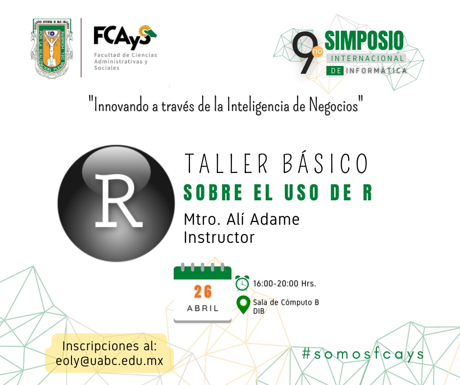
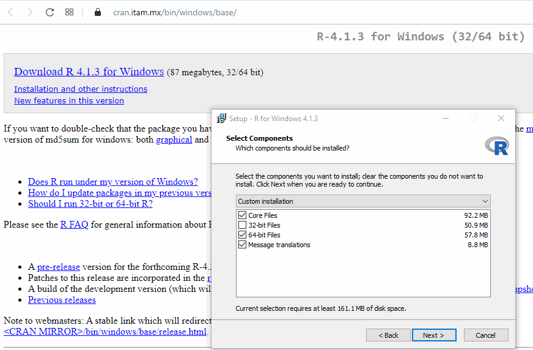
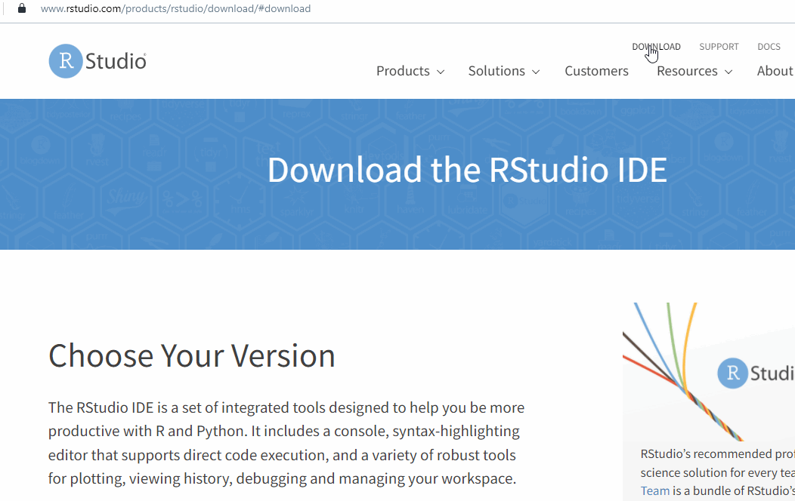

# Recursos para Taller de R para principiantes (y autodidactas)

## Importante:
El siguiente material es de dominio público o con licencia creative commons (CC-BY) de atribución. Todos los autores de los mismos merecen el crédito por lo que han hecho y se presentan a continuación, con sus respectivos trabajos.

## Sobre el material
Este material es una compilación de contenidos valiosos aplicables al lenguaje de programación R, el cuál tiene un enfoque más aplicable al análisis estadístico y a la automatización en el procesamiento de datos, muy útil aunque no limitado a: clustering, regresión de datos y por consecuencia la aplicación de uno o varios algoritmos sobre datos, con usos tan básicos como obtener modas, promedios, desviaciones estándar hasta análisis de datos mediante inteligencia artificial. La principal bonda de R frente a otros lenguajes es que su finalidad máxima y valor radica en poder evaluar los datos en sus formas estructuradas o no estructuradas.

Este material se presenta a la audiencia del Taller básico del lenguaje R y se segmenta en tres fases con el objetivo que la audiencia se convierta en un aprendiz de R autodidacta, de forma que más allá de la actividad del 26 de abril de 2022, que forma parte del 9no. Simposio Internacional de Informática de la Facultad de Ciencias Administrativas y Sociales de la Universidad Autónoma de Baja California (UABC), Campus Ensenada, para mayor información visita [http://fcays.ens.uabc.mx/carrera/inteligenciadenegocios/] y [http://fcays.ens.uabc.mx/carrera/informatica/]

## Contenido
El contenido de este material se enfoca en tres niveles que trataremos de abarcar en forma general, aumentando la complejidad en cada nivel.
1. FASE INICIAL, (Introducción a R, y operadores y funciones): Es esta sección se aborda mediante diapositivas a divesos autores que elaboraron material con mucha calidad, en qué consiste R, cómo ha evolucionado, quién lo mantiene actualmente y se ve una introducción rápida sobre las generalidades del lenguaje, sus funciones, operadores, estructuras generales, el uso de librerías, entre otros temas de base.
    1. Introducción e historia
[https://cihh.utp.ac.pa/sites/default/files/documentos/2022/pdf/manual-introduccion-r.pdf] [https://github.com/oscarperpinan/R/blob/master/docs/intro.pdf]
    2. Instalación de R y R Studio ¿y qué es R Studio? (Ejemplo de la Univ. de Granada https://www.ugr.es/~jchica/Pagina2/GUIME/R/Introduccion%20R.pdf)
     [https://cran.itam.mx/bin/windows/base/]
     [https://www.rstudio.com/products/rstudio/download/]
    3. Operadores, datos y operaciones básicas
        - Una introducción rápida [https://cihh.utp.ac.pa/sites/default/files/documentos/2022/pdf/manual-introduccion-r.pdf]
        - Funciones y operaciones de lecturada de datos [https://github.com/oscarperpinan/R/blob/master/docs/datos.pdf]
        - Lo anterior, más avanzado [https://github.com/JosmanPS/Curso-R-ITAM-2015/blob/master/Lectura02/Lectura02-Comandos%20b%C3%A1sicos.md]
    4. Funciones (opcional) [https://github.com/oscarperpinan/R/blob/master/docs/Funciones.pdf]
    5. Pausa para hidratación. Los mejores del mundo se toman pausas para hidratarse y descansar. 
3. FASE INTERMEDIA, (Análisis aplicado a los datosAplicaciones prácticas del día a día): En esta sección se profundiza bastante más ya usando las funciones y los operadores para lograr obtener información a partir de los datos y para ello nos remitimos a los datos de la Data Expo de la ASA sobre aeronautica de los Estados Unidos de 1987 a 2008. Es importante mencionar estos datos son abiertos.
    1. Comprendiendo las diversas presentaciones de los datos estructurados, semi-estructurados y no estructurados.
    2. Descargando los datos de la Expo 2009 con datos de vuelo de 1987 a 2008 de Aeronáutica de Estados Unidos. [https://doi.org/10.7910/DVN/HG7NV7]
    3. Nuestros primeros ejercicios con datos tomados de la Data Expo 2009 y las funciones (y librerías) de graficación. Probar de la linea 1 a la 50 del archivo para entender de qué va todo esto de R [https://github.com/aldaca15/Recursos-Intro-a-R-principiantes/blob/main/data/datosExpo.Avanzados.R]
    4. Pausa para hidratación. 
4. FASE AVANZADA, (Aplicaciones más especificas usando librerías): En esta sección prácticamente se replica un documento revisado por pares, en donde se hace análisis de textos a partir de la fascinante herramienta 'syuzhet' que es multilenguaje y nos ayuda a descrifrar qué sentimientos se pueden usar en textos. Dentro de la carpeta Data se incluyeron algunas canciones famosas para hacer a partir de ellas el análisis y acortar el tiempo de procesamiento de syuzhet pues puede demorar varios minutos en hacer los cómputos para determinar las emociones de los textos. Las canciones estan displonibles en [https://github.com/aldaca15/Recursos-Intro-a-R-principiantes/tree/main/data/letras] y hay un ejemplo del resultado final visto desde R Studio en [https://github.com/aldaca15/Recursos-Intro-a-R-principiantes/blob/main/data/letras/2022-04-26-MexicoEnLaPiel.png]
    1. Usando librerías avanzadas para procesamiento de datos en formato texto, utilidades.
    2. Análisis de emociones en textos utilizando la librería "syuzhet", un artículo de Jennifer Isasi [https://doi.org/10.46430/phes0051]
    3. Agradecimientos y siguientes pasos como pueden ser el revisar y todas las lineas de la 100 a la 450 del archivo de análisis de datos de la Data Expo 2009 a conciencia pues es muy interesante cuando ya tienes datos y los graficas usando funciones.

# BONUS
Se incluye material bono y los contenidos usados en el taller en una carpeta llamada "data", visible en las opciones de navegación de GitHub. Si alguien está interesado en hacer una versión expandida de este curso puede hacer un fork del mismo, haciendo mención de su servidor entre los créditos.

# Material consultado y enlaces útiles
## Agradecimientos
El material presentado aunque presentan licencias de uso no comercial, apropiación y remezcla e inclusive dominio público fue elaborado gracias a los esfuerzos del Departamento de Cómputo del ITAM. Gracias al proyecto R y sus miles y miles de voluntarios. Otros agradecimimentos a U. de Granada, José Jiménez, José Manuel Proudinat, Jennifer Isasi y el equipo de MAXIMA FORMACION por lo materiales generados y su compromiso con el software libre y el material de uso gratuito y altamente didáctico.
## Y por último pero no menos importante un agradecimiento a la UABC y en particular a la Coordinación y Academia de la Carrera por la realización de actividades especiales para la formación complementaria de estudiantes y otros interesados.

# Enlaces a materiales consultados y sus autores.
Instalacion de R. Ejemplo de instalación hecho por la U. de Granada
https://www.ugr.es/~jchica/Pagina2/GUIME/R/Introduccion%20R.pdf

Introducción a R y R Studio por José Ulises Jiménez, Univ. Tecnológica de Panamá, 2019 [material bajo licencia CC-BY]
https://cihh.utp.ac.pa/sites/default/files/documentos/2022/pdf/manual-introduccion-r.pdf

Material sobre Curso de R en el ITAM, elaborado por José Manuel Proudinat en 2015 [liberado bajo licencia MIT en GitHub]
1. Segmento de comandos básicos https://github.com/JosmanPS/Curso-R-ITAM-2015/blob/master/Lectura02/Lectura02-Comandos%20b%C3%A1sicos.md
2. Repositorio general https://github.com/JosmanPS/Curso-R-ITAM-2015

Material didáctico (diapositivas, datos y código) adecuado a cursos introductorios a R. Material elaborado por Oscar Perpiñán Lamigueiro [con licencia CC-BY]
https://oscarperpinan.github.io/R/
Con mención especial a los temas:
1. Introducción R https://github.com/oscarperpinan/R/blob/master/docs/intro.pdf
2. Funciones con R https://github.com/oscarperpinan/R/blob/master/docs/Funciones.pdf
3. Clases y métodos con R https://github.com/oscarperpinan/R/blob/master/docs/ClasesMetodos.pdf
4. Manipulación de Datos con R y url de datos para jugar
https://github.com/oscarperpinan/R/blob/master/docs/datos.pdf
https://github.com/oscarperpinan/R/raw/master/data/aranjuez.csv

Manual técnico oficial de R en inglés (actualizado) y español [material de dominio público]
1. Manual actualizado (en idioma inglés) https://cran.r-project.org/doc/manuals/r-release/R-intro.pdf
2. Manual en español https://cran.r-project.org/doc/contrib/R-intro-1.1.0-espanol.1.pdf

"Expo 2009":
2008, "Data Expo 2009: Airline on-time performance data", https://doi.org/10.7910/DVN/HG7NV7, Harvard Dataverse, V1
1. Repositorio principal https://community.amstat.org/jointscsg-section/dataexpo/dataexpo2009
2. Infografía del evento https://stat-computing.org/dataexpo/2009/posters/wicklin-allison.pdf

Jennifer Isasi, "Análisis de sentimientos en R con 'syuzhet'", Programming Historian en español 5 (2021), https://doi.org/10.46430/phes0051.
https://programminghistorian.org/es/lecciones/analisis-de-sentimientos-r

Sobre las licencias Creative Commons y MIT
1. Creative Commons [https://creativecommons.org/licenses/?lang=es]
2. MIT [https://opensource.org/licenses/MIT]

# Sobre el instructor del Taller, Alí Adame
Amante de la tecnología desde que tengo memoria. Disfruto de apoyar a las personas a involucrarse en la sociedad de la información del siglo XXI a través del software y los datos. Entusiasta del eLearning, así como promotor de la transferencia tecnológica y la Inteligencia Artificial.
Para saber más consulta el siguiente CV [https://github.com/aldaca15/resume/blob/main/resume.pdf]

